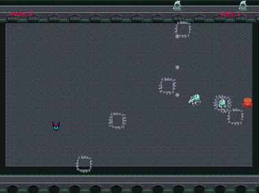
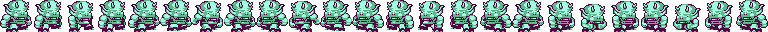

# Asphixya

> This is a small shooter game made for microverse.



This is an arcade like game, with just one scene were a bunch of enemies spawn and try to kill you, it starts easy but quickly you will be overwhelmed by the increasing amount of enemies.

## How to play

- Move around using WASD on your keyboard
- Shot with the arrow keys

### Enemies


- This monster bounces through all the screen when it hits an obstacles, it only stops to shot projectiles in four directions.


- This monster follows you and stops from time to time to place obstacle in your way which can be destroyes once tho monster get out of them.


- This monster moves vertically and stops to shoot projectiles.


## Built With

- HTML
- CSS
- JAVASCRIPT
- PHASER
- WEBPACK
- JEST
- NODE

## Live Demo

[Live Demo Link](https://livedemo.com)


## Getting Started

To get a local copy up and running follow these simple example steps.

### Prerequisites

- npm
- git

### Setup

- First we need to clone the project, open your terminal and cd to the directory where you want the project to be in.
- Once inside the location, use the following comand to get a copy of this repository.
```
git clone git@github.com:JohannRodriguez/javascript-capstone.git
```
- You can now cd into the new created directory to start working.

### Install

- In your terminal, inside the project location, run the following command to install node packages:
```
npm install
```
- Followed by:
```
npm run build
```

### Usage

- Once we install everything we can start using the game, in your terminal run:
```
npm run start
```
- Wait for the project to compile, then open a new internet tab and wo to this location as you would with any internet page:
```
http://localhost:3500/dist/
```

### Run tests

- To run tests use this command:
```
npm run test
```


## Authors

👤 **Johann Rodriguez**

- Github: [@JohannRodriguez](https://github.com/JohannRodriguez)
- Twitter: [@BSapce](https://https://twitter.com/BSapce)
- Linkedin: [Johann Rodríguez](https://www.linkedin.com/in/johann-alonso-rodriguez-vazquez/)


## 🤝 Contributing

Contributions, issues, and feature requests are welcome!

Feel free to check the [issues page](https://github.com/JohannRodriguez/javascript-capstone/issues).

## Show your support

Give a ⭐️ if you like this project!

## Acknowledgments

- [Lunarsigan's monsters on OpenGameArt](https://opengameart.org/content/overhead-action-rpg-characters?fbclid=IwAR1w8r-MhLLTKr4PDkcUeGVhiLUgUBUMtLCsGk2UeoIt0IWH2JeNn0-xrSg)
- [Beast's sewer backgrounds on OpenGameArt](https://opengameart.org/content/sewer-tileset?fbclid=IwAR06djtBjLBZa9lEmHwFyQHQN0DI5ChzYoIbAOkJgz4sSSdE-6WCncSr6M4)
- [Radomir Dopieralski's betty on OpenGameArt](https://opengameart.org/content/one-more-lpc-alternate-character?fbclid=IwAR34gTva2U2KBUrryu9AFpcprknPcmAtTDusZjTNnihiGShhSjMjDncr1po)
- [The Last of Us - Royalty free music](https://www.youtube.com/royaltyfreezone)

## 📝 License

This project is [MIT](lic.url) licensed.